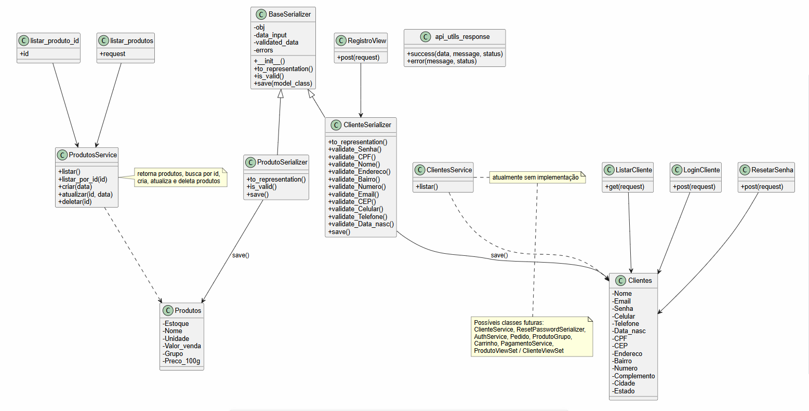

# Diagrama de Classes em PlantUML

## Observações

- `ClienteSerializer` herda a validação de `BaseSerializer` e adiciona validações específicas por campo.
- `ProdutoSerializer` reimplementa `is_valid()` e chama `super().save(Produtos)`.
- `ProdutosService` é o provedor de acesso aos dados de produtos.
- `ClientesService` está definido, mas ainda sem implementação.

> Este arquivo pode ser usado como base para documentação e para evoluir o design com novas entidades e serviços.
